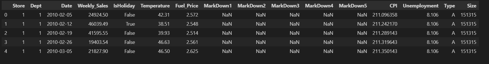
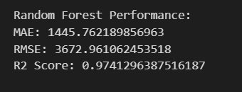
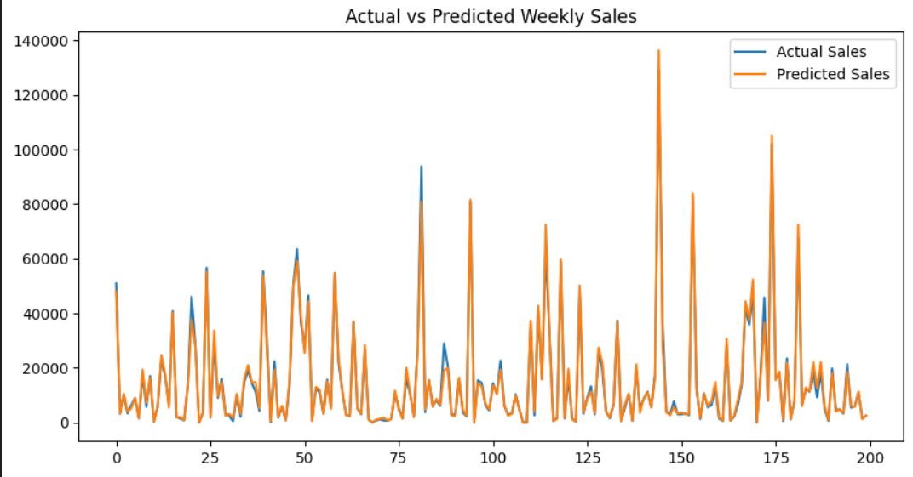

# Walmart Weekly Sales Prediction

## Project Overview
This project predicts weekly sales for Walmart stores using Machine Learning.  
A Random Forest Regressor was trained on historical sales, store, and economic data to achieve high prediction accuracy.

## Dataset
- Source: Walmart Sales Dataset
- Records: 421,570 rows
- Features include Store, Department, Date, Temperature, Fuel Price, CPI, Unemployment, and Holiday indicators.

## Data Preprocessing
- Handled missing values using forward fill
- Converted date into Month and Week features
- Encoded categorical variables
- Performed train-test split

## Models Used
- Linear Regression
- Random Forest Regressor

## Results
- **Random Forest R² Score:** 0.97
- **MAE:** 1445
- **RMSE:** 3672

## Visualizations
### Dataset Preview

### Model Performance

### Actual vs Predicted Sales

### Feature Importance

## Conclusion
The Random Forest model successfully captured complex patterns in weekly sales and significantly outperformed Linear Regression.
