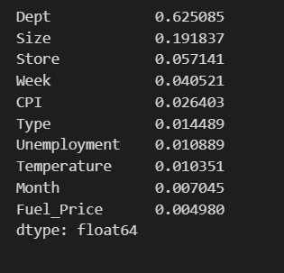

# Walmart Weekly Sales Prediction

## Project Overview
This project predicts weekly sales for Walmart stores using Machine Learning.  
A Random Forest Regressor was trained on historical sales, store, and economic data to achieve high prediction accuracy.

## Dataset
- Source: Walmart Sales Dataset
- Records: 421,570 rows
- Features include Store, Department, Date, Temperature, Fuel Price, CPI, Unemployment, and Holiday indicators.

## Data Preprocessing
- Missing values handled using forward fill
- Date column converted into Month and Week features
- Categorical features encoded
- Train-test split performed

## Models Used
- Linear Regression
- Random Forest Regressor

## Results
- **Random Forest R² Score:** 0.97  
- **MAE:** 1445  
- **RMSE:** 3672  

## Visualizations

### Dataset Preview

### Model Performance Metrics

### Actual vs Predicted Weekly Sales

### Feature Importance Analysis

## Conclusion
The Random Forest model effectively captured complex sales patterns and significantly outperformed Linear Regression, making it suitable for real-world retail sales forecasting.
